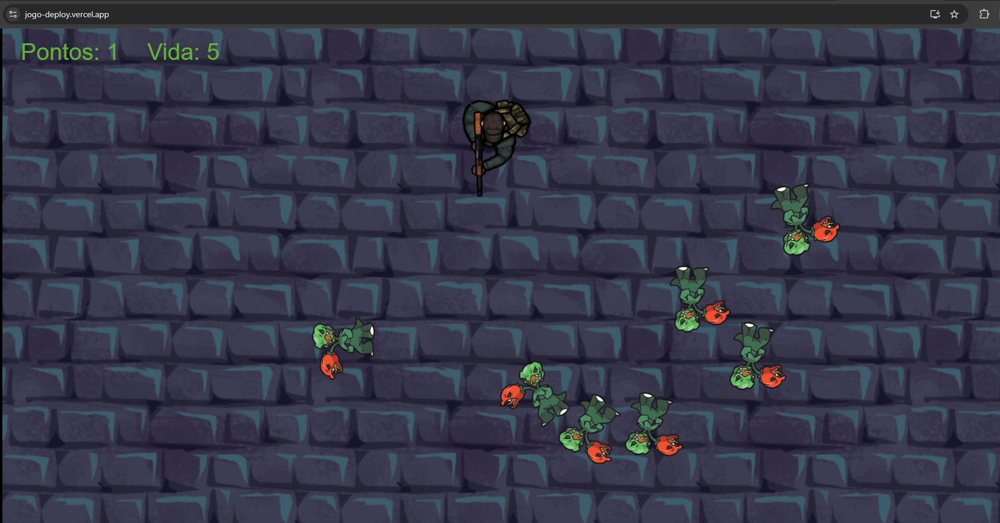
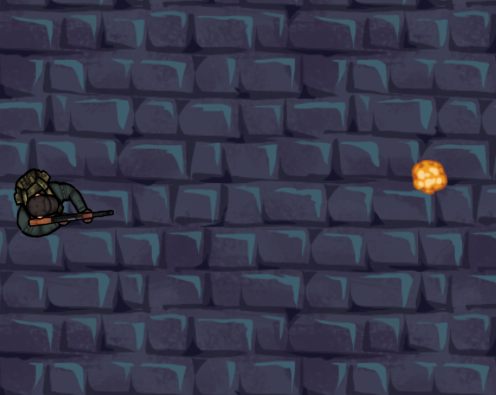
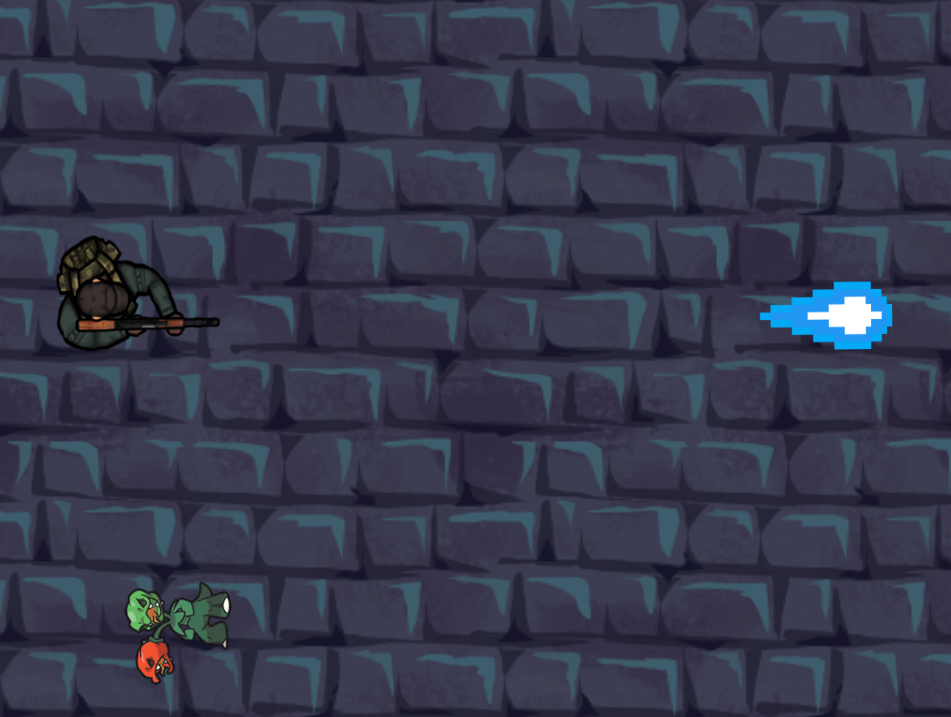
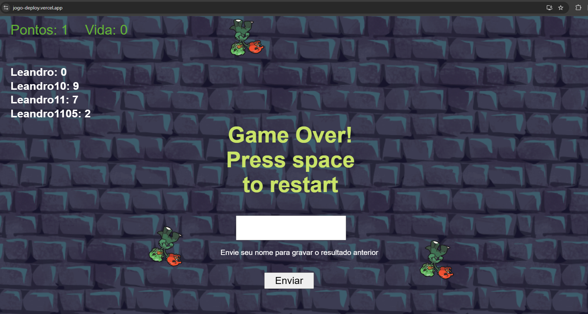
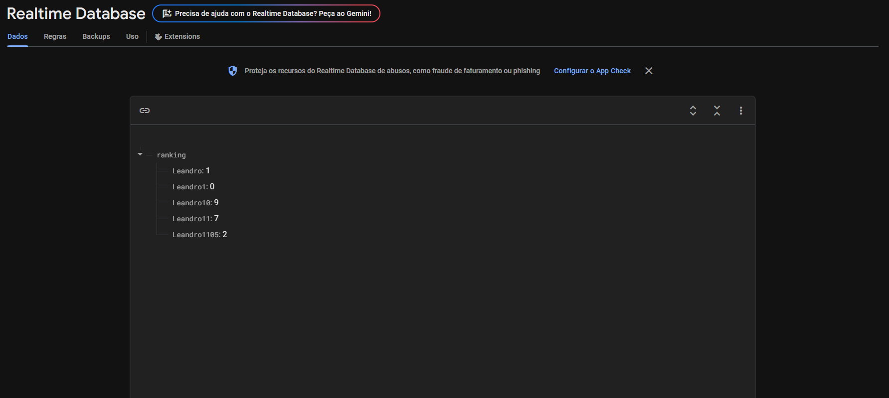

# 🗡️ Goblin Slayer - Mini Game

---

## 🎮 Sobre o Jogo

**Goblin Slayer** é um jogo criado para a disciplina de jogos do uni facef.  
O objetivo é **sobreviver o máximo possível** e **acumular pontos eliminando os inimigos**.

O jogo foi desenvolvido totalmente na plataforma **Construct 3**, ideal para protótipos rápidos e jogos casuais.

---

## 🔗 Link

- https://jogo-deploy.vercel.app/

---

## 🧠 Mecânicas Básicas

- ⚔️ **Ataque**: Clique no botão de ataque para eliminar goblins próximos.
- ⚔️ **Ataque Especial**: A cada 5 segundos, você tem um ataque especial que elimina um goblin com 1 hit.
- 🧍 **Movimento**: Use as setas para se mover pelo mapa.
- ❤️ **Vida**: Se um goblin encostar em você, você perde vida!
- 💯 **Pontuação**: Cada goblin derrotado dá pontos. Tente bater seu recorde!

---

## 🕹️ Controles

| Ação            | Tecla/Comando                |
|-----------------|------------------------------|
| Iniciar         | Espaço                       |
| Mover           | Setas                        |
| Ataque básico   | Botão esquerdo do mouse      |
| Ataque especial | Botão direito do mouse       |

> *Obs: O jogo é compatível com mouse.*

---

## 📦 Recursos Utilizados

- **Construct 3** - Engine principal do jogo
- **Firebase** - para guardar informações de score
- **Sprites gratuitos** - Sprites retirados da internet

---

## 📸 Imagens

- **Tela Inicial do jogo**

- **Ataque básico**

- **Ataque Especial**

- **Ranking**

- **Firebase**

---

## Aluno

Leandro Andrade Vieira - 24003

---
